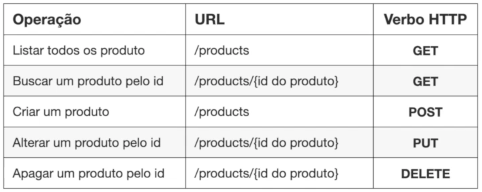

# Criando a primeira função Lambda
## Lambda
=> Função
=> Trigger
=> Evento
=> Runtime
=> Concorrência
- Custo por tempo de execução e memória consumida
- Otimizações para redução de tempo de execução e memória consumida são prioridades
- Gráficos de monitoramento
- Logs no CloudWatch
- Monitoramento com X-Ray

## Projeto do Curso 
- Sistema de ECommerce fictício;
- Gerenciamento de produtos/pedidos;
- Geração de eventos;
- Importação de notas fiscais;
- Mecanismo de auditoria;
- Alarmes.

#### Gerenciamento de Produtos

***

# Criando o primeiro serviço do ECommerce no AWS API Gateway
- Validação de URI
- Validação de verbos HTTP
- Validação do corpo das requisições
- Integração com outros recursos AWS
- Integração com AWS Cognito para autenticação e autorização de usuários
- Gráficos de monitoramento
- Logs no CloudWatch
- Custo por requisição e quantidade de dados transferidos
- API Gateway é uma ferramenta que atua como intermediário entre um cliente de API e serviços de back-end. Ele funciona como um ponto de entrada único para chamadas de API, permitindo a comunicação e a transferência de dados entre endpoints. 
***

# AWS Lambda Layers - Conceitos
- Recurso para organização de pedaços de libs, códigos, que podem ser compartilhadas entre várias funções Lambda
- Vantagem: ambas funções ficam menores, com desempenho de inicialização melhor
- Ex: Products Fetch **->** Products Layer **<-** Products Admin
***

# AWS DynamoDB
- BD no sequel: par chave/valor
- Funciona com unidades de leitura/escrita

***

# AWS X-Ray
## O que é?
- Sistema de tracing (rastreamento) distribuído
- Análise de consumo de tempo

## Como habilitar
- Habilite a opção tracing na construção da função Lambda
- Capture as chamadas ao SDK da AWS, dentro da função Lambda
***

# AWS Lambda - Invocação síncrona e assíncrona
***

# ORDEM PARA A CRIAÇÃO DE UMA NOVA FUNÇÃO LAMBDA
EXEMPLO -> PEDIDOS
- Criar stack do Lambda Layer do repositório de pedidos
- Criar stack de aplicação de pedidos
- Criar tabela de pedidos
- Importar Lambda Layer do repositório de pedidos
- Criar função de pedidos
- Adicionar o serviço de pedidos ao API Gateway existente
- Criar modelo de pedidos no Lambda Layer
***

# AWS SNS
## SNS
- Alta taxa de mensagens por segundo
- Permite filtragem de mensagens
- Mensagem publicada em um tópico é replicada entre todos os inscritos
- Pode ser utilizada com filas do tipo FIFO

#### SNS - Publisher
- Aplicação rodando num ECS
- Lambda
- Eventos do CloudWatch
- Outro recurso da AWS
- Garantia de entrega de pelo menos uma cópia da mensagem
- Pode haver inversão de mensagens
- Precisa ter permissão para publicar mensagens

#### SNS - Subscriber
- Funções Lambda
- Filas SQS
- Email
- HTTP
- Cada inscrito recebe uma cópia da mensagem publicada